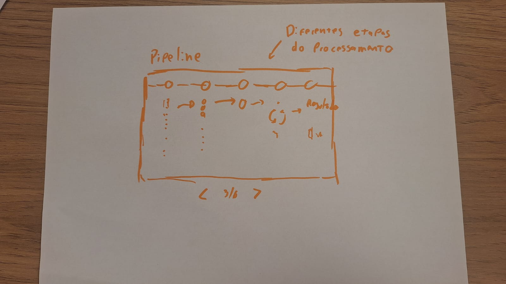

# Esteira de Otimizacao de Limites

## Introducao a proposta

Esta microinterface em p5.js demonstra, de forma animada, como uma base de clientes pode ser processada por um modelo de otimizacao de limites pre-aprovados de cartao de credito para Banco PAN / BTG Pactual.

A animacao representa o processamento em seis etapas: entrada da base, filtro de elegibilidade, classificacao por risco, motor de otimizacao, validacao de restricoes e comparacao entre cenario atual e otimizado.

## Rascunhos iniciais

A ideia inicial foi transformar o modelo matematico em uma esteira visual:

1. Clientes entram como pontos com atributos.
2. Clientes restritos sao removidos do fluxo.
3. Clientes elegiveis sao agrupados por faixas de PD.
4. O motor busca um limite que equilibre receita de interchange e perda esperada.
5. Portoes validam minimo operacional, teto, capacidade de pagamento e inadimplencia financeira.
6. O resultado final compara limite atual e limite sugerido.

## Registro do resultado obtido

O prototipo possui:

- animacao demonstrativa do processamento;
- clientes representados por cor de risco e tamanho de capacidade de pagamento;
- controles de simulacao para rodar, pausar e reiniciar;

## Como executar

Abra o arquivo `index.html` no navegador. A pagina usa p5.js via CDN.
